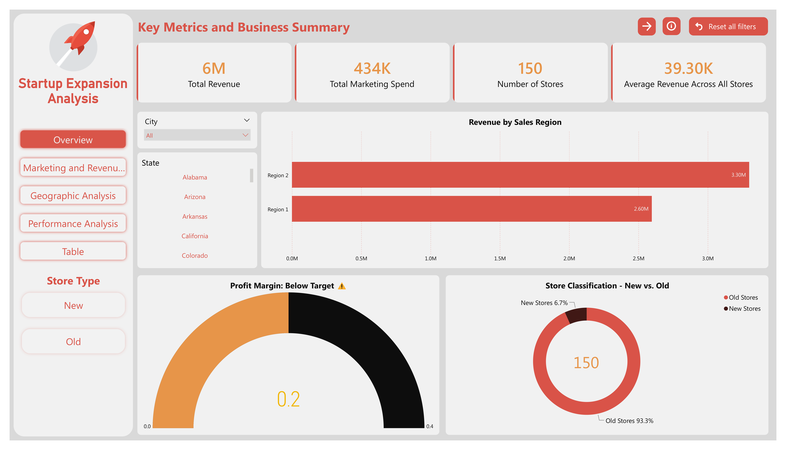
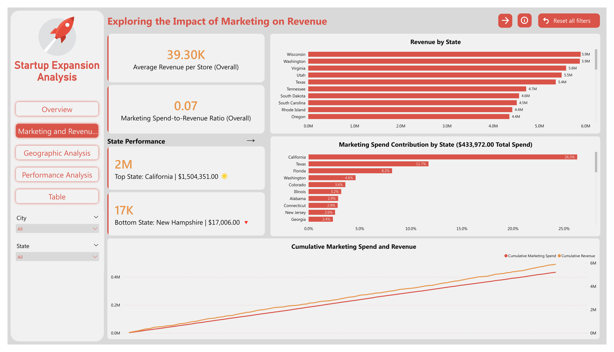
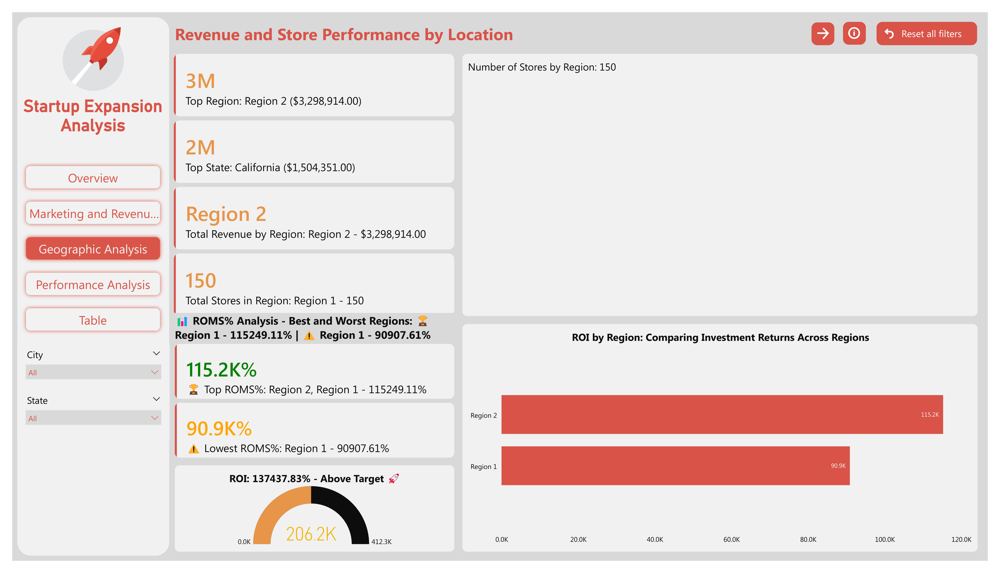
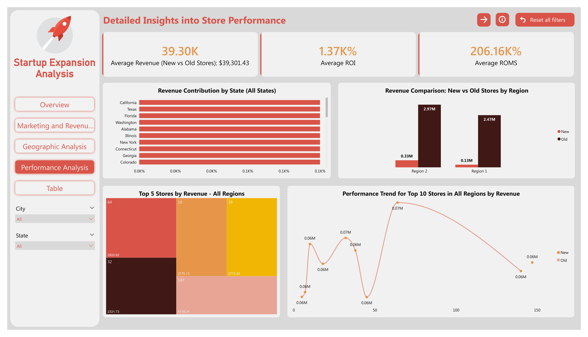
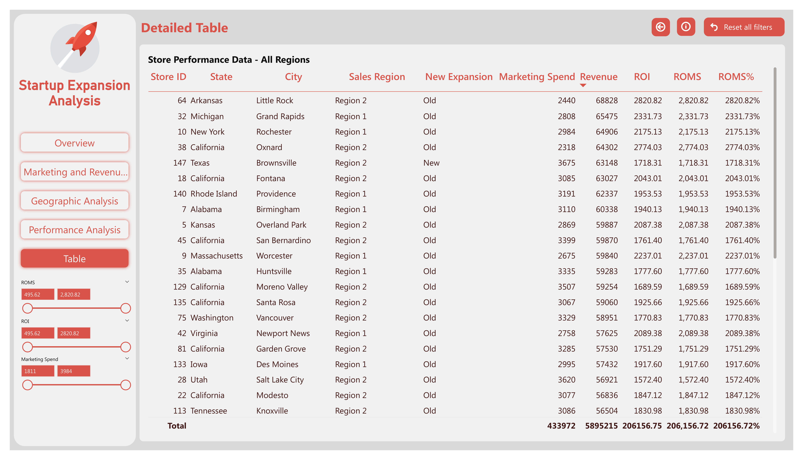

# Startup Expansion Analysis Dashboard 🚀

## Overview
This project analyzes the performance of a startup's store expansion across regions in the United States. Using **Python** & **Power BI**, the dashboard provides key insights into revenue, marketing efficiency, and store performance.

## Features
- **Python Notebook**
The `data_preprocessing_and_analysis.ipynb` notebook includes:
   - Data cleaning: Handling duplicates, missing values, and formatting.
   - Exploratory data analysis (EDA): Basic statistics and visualizations.
   - Data preparation: Transformations for Power BI integration.
- **Interactive Dashboard**: 
  - **Overview Page**: Key metrics and business summary.
  - **Marketing and Revenue Insights**: Analysis of marketing spend and its impact on revenue.
  - **Geographic Analysis**: Revenue distribution and store performance by region.
  - **Performance Analysis**: Detailed comparisons of new vs. old stores and ROI trends.
  - **Detailed Table**: Store-level data for in-depth exploration.

## Highlights
- **Total Revenue**: $5.89M
- **Marketing Spend**: $434K
- **Top State by Revenue**: California ($1.5M 🌟)
- **Bottom State by Revenue**: New Hampshire ($17K 🔻)
- **ROI Analysis**: Above target (137,437.83% 🚀)
- **Top Performing Store**: Store 38, California (Revenue: $64,302)

## Files and Directory Structure
- `data/`: Contains the raw dataset used for analysis.
- `docs/`: Includes the PDF report summarizing the project.
- `src/`:
  - Python Notebook: Jupyter notebook for data preprocessing and analysis `(data_preprocessing_and_analysis.ipynb)`.
  - Power BI `.pbix` file to reproduce the dashboard.
- `images/`: Screenshots of the dashboard pages.

## Dashboard Pages
### 1. Overview Page


### 2. Marketing and Revenue Insights


### 3. Geographic Analysis


### 4. Performance Analysis


### 5. Detailed Table


## Usage Instructions
1. **Clone the Repository**:
   ```bash
   git clone https://github.com/yourusername/Startup-Expansion-Analysis-Dashboard.git
   ```
2. Open the `src/PowerBI-Report.pbix` file in Power BI Desktop.
3. Load the dataset from `data/startups-expansion-modified.csv`.
4. Explore the interactive dashboard.

## Key Insights
- **Marketing Efficiency**: California accounts for 26.3% of total marketing spend and generates the highest revenue.
- **Regional Trends**: Region 2 outperforms Region 1 with $3.3M revenue vs. $2.6M.
- **Store Performance**: Old stores dominate with 93.3% revenue contribution.

## License
This project is licensed under the MIT License.

## Contributing
Contributions are welcome! Please open an issue or submit a pull request for enhancements.


